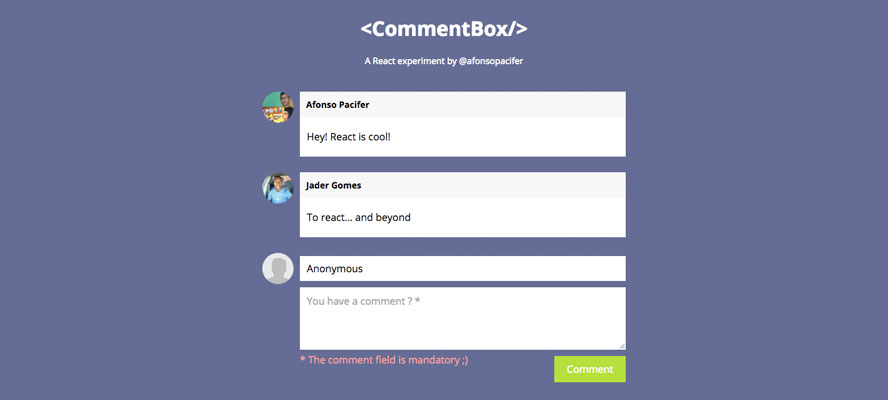

# React Comments

> A React demo component for comment feed. [View online](http://afonsopacifer.github.io/react-comments/).



## Versioning
To keep better organization of releases we follow the [Semantic Versioning 2.0.0](http://semver.org/) guidelines.

## Run the [demo](http://afonsopacifer.github.io/react-comments/) locally
**1 -** Prepare the environment:

```sh
$ npm i -g browserify
$ npm i -g watchify
```

**2 -** Clone the project and install the dependencies:

```sh
$ git clone https://github.com/afonsopacifer/react-comments.git
$ cd react-comments
$ npm install
```
**3 -** Run static server and browserify/reactify/watchify:

```sh
$ npm start
```

**Go to:** [localhost:5000](http://localhost:5000/)

## Contributing
Find on our [issues](https://github.com/afonsopacifer/react-comments/issues/) the next steps of the project or report a bug ;)
<br>
Want to contribute? [Follow these recommendations](https://github.com/afonsopacifer/react-comments/blob/master/CONTRIBUTING.md).

## History
See [Releases](https://github.com/afonsopacifer/react-comments/releases) for detailed changelog.

## License
[MIT License](https://github.com/afonsopacifer/react-comments/blob/master/LICENSE.md) © [Afonso Pacifer](http://afonsopacifer.com/)
